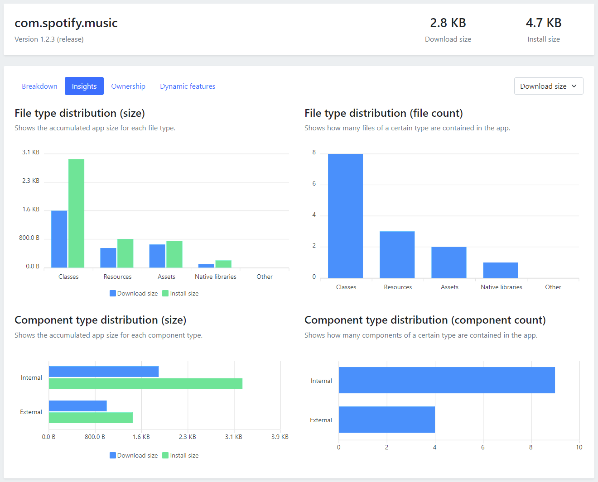
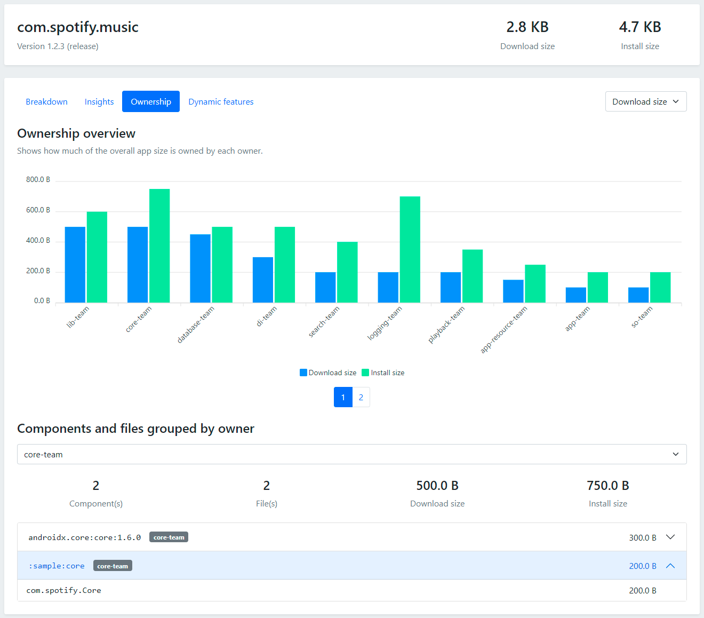

<p></p>


_Ruler is a Gradle plugin which helps you analyze the size of your Android apps._

[](https://github.com/spotify/ruler/actions)
[](https://github.com/spotify/ruler/releases)
[](https://github.com/spotify/ruler/blob/main/LICENSE)

## Motivation

App size is an important metric which [directly correlates with business metrics](https://medium.com/googleplaydev/shrinking-apks-growing-installs-5d3fcba23ce2) like install conversion rate. Measuring app size is straightforward, but knowing what contributes to it is not. Especially in bigger projects with hundreds or thousands of modules and third-party dependencies. Ruler provides a convenient way to find out how much each module and dependency contributes to the total size of your app by running a single Gradle task.

<table>
  <tr>
    <td></td>
    <td></td>
  </tr>
</table>

## Usage

Follow the following steps to start using Ruler in your project.

### Adding the plugin

First you need to add the Ruler Gradle plugin to the buildscript classpath in your top-level `build.gradle` file:

```kotlin
buildscript {
    repositories {
        google()
        mavenCentral()
    }
    dependencies {
        classpath("com.spotify.ruler:ruler-gradle-plugin:2.0.0-beta-3")
    }
}
```

You also have to apply the plugin in the `build.gradle` of your application module:

```kotlin
plugins {
    id("com.android.application")
    id("com.spotify.ruler")
}
```

### Configuring the plugin

When using [app bundles](https://developer.android.com/guide/app-bundle), Google Play will generate optimized APKs for each device. This means that the size of an APK depends on the specifications of the device that's downloading it. You can configure which device specifications should be used for the analysis in the `build.gradle` of your application module:

```kotlin
ruler {
    abi.set("arm64-v8a")
    locale.set("en")
    screenDensity.set(480)
    sdkVersion.set(27)
}
```

#### Verification

Optionally, you can also configure Ruler to verify that your application size is under a given
threshold.

```kotlin
ruler {
    verification {
        downloadSizeThreshold = 2 * 1024 * 1024 // 2 MB in bytes
        installSizeThreshold = 2 * 1024 * 1024 // 2 MB in bytes
    }
}
```

### Running the task

Once this is done, `analyze<VariantName>Bundle` tasks will be added for each of your app variants. Running this task will build the app and generate a HTML report, which you can use to analyze your app size. It will also generate a JSON report, in case you want to further process the data.

## Ownership

In larger organizations, Gradle modules and dependencies are often owned by specific teams. If that's the case for your app, Ruler can help you analyze app size contributions by different teams. All you need to do is provide a YAML file listing all components and their owners. It's also possible to specify ownership for individual files, if some of the files within a component are owned by a different team:

```yaml
# Identifier for Gradle modules -> path of the module
- identifier: :sample:app
  owner: app-team

# Identifier for dependencies -> dependency shorthand without the version
- identifier: androidx.core:core
  owner: core-team

# Identifier for individual files -> Full path/name as it shows up in the APK
- identifier: com.sample.MainActivity
  owner: main-team

# Identifier for dynamic feature modules -> name of the module
- identifier: dynamic-feature
  owner: dynamic-feature-team

# Wildcard identifier -> matches multiple components (modules or dependencies) or files
- identifier: :sample:wildcard:*
  owner: wildcard-team
```

This ownership file can be maintained manually, but in most cases it will be more practical to generate it during the build. You can point Ruler to your YAML file in the `build.gradle`, you can also configure default owners for components missing from the ownership file:

```kotlin
ruler {
    ownershipFile.set(project.file("/path/to/ownership.yaml"))
    defaultOwner.set("default-team") // unknown by default
}
```

When you pass an ownership file to Ruler, you'll see a new tab in the HTML report with app size insights broken down by team:



## Project structure

Ruler is built with Kotlin and contains multiple modules:

- **ruler-gradle-plugin:** Core Gradle plugin where the APK parsing, dependency handling and attribution logic lives.
- **ruler-frontend:** React template used for the HTML report, built with Kotlin JS.
- **ruler-models:** Common models shared between the Gradle plugin and the frontend, built with Kotlin Multiplatform.
- **ruler-frontend-tests:** UI tests for the HTML report frontend.
- **ruler-e2e-tests:** End-to-end tests verifying the plugin using the sample project.

### Working with this project

The project is set up like a standard Gradle project. You can build it using `./gradlew assemble` and run the tests with `./gradlew test`.

There is also a sample project, which shows the usage of the plugin. Because the way this sample project is set up, the initial build can fail if you bump the plugin version. To fix this, you have to publish the plugin to your local Maven repository by running `./gradlew publishToMavenLocal -PwithoutSample`.

When working on the frontend, you can start a development server by running `./gradlew browserRun`, which will show a report filled with dummy data to make development easier.

## Compatibility

The latest version of this plugin is compatible with

- Java 17 or above,
- Gradle 8.4 or above and
- Android Gradle Plugin 8.2.0 or above.

Earlier versions might also work, but compatibility can't be guaranteed.

## How to contribute

We want your help to improve Ruler! You can contribute by opening issues for bugs and ideas for improvement.

You can also contribute directly by solving open issues. Specifically look out for issues marked as [bugs](https://github.com/spotify/ruler/labels/bug), [good first issues](https://github.com/spotify/ruler/labels/good%20first%20issue) and [help wanted](https://github.com/spotify/ruler/labels/help%20wanted).

## Code of conduct

This project adheres to the [Open Code of Conduct](https://github.com/spotify/code-of-conduct/blob/master/code-of-conduct.md). By participating, you are expected to honor this code.

## License

```
Copyright 2021 Spotify AB

Licensed under the Apache License, Version 2.0 (the "License");
you may not use this file except in compliance with the License.
You may obtain a copy of the License at

    http://www.apache.org/licenses/LICENSE-2.0

Unless required by applicable law or agreed to in writing, software
distributed under the License is distributed on an "AS IS" BASIS,
WITHOUT WARRANTIES OR CONDITIONS OF ANY KIND, either express or implied.
See the License for the specific language governing permissions and
limitations under the License.
```
